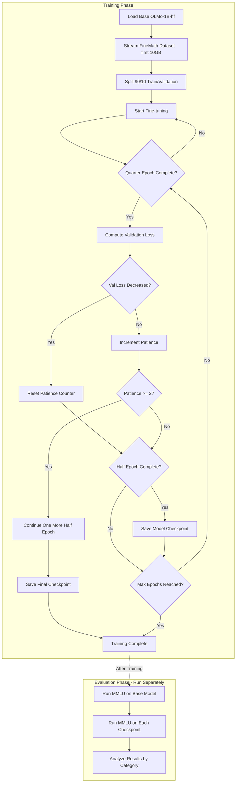

# Fine-tuning Experiment: Investigating BOS Token Generations as Training Data Proxies

## Overview

This project investigates the hypothesis that when an LLM generates text starting from only the Beginning-of-Sentence (BOS) token, the distribution of generated topics approximates a random sample from the original training data distribution. This property may explain why BOS-token generations can mitigate catastrophic forgetting during fine-tuning.

### Hypothesis

When fine-tuning causes the model to "forget" knowledge, the distribution of BOS-token generations should shift correspondingly. By measuring:
1. MMLU performance before and after fine-tuning (ground truth capability measurement)
2. Category distribution of BOS-token generations before and after fine-tuning

We can test whether BOS-token generation distribution changes correlate with actual capability changes.

---

## Experiment Design

### Model
- **Base Model**: `allenai/OLMo-1B-hf` (HuggingFace-compatible 1B parameter model)
- **Training**: Full fine-tuning (all parameters updated)

### Dataset
- **Training Data**: `HuggingFaceTB/finemath-4plus` (mathematics-focused dataset)
- **Subset Size**: ~10GB (stream first ~10GB from dataset)
- **Validation Split**: 10% held out from training data
- **Objective**: Causal language modeling (next-token prediction)

### Tokenization
| Parameter | Value |
|-----------|-------|
| Max Sequence Length | 2048 tokens |
| Padding Strategy | Pad to max length within each batch (simple padding, no packing) |
| Truncation | Truncate sequences longer than 2048 tokens |

### Training Configuration
| Parameter | Value |
|-----------|-------|
| Learning Rate | 2e-5 (peak) |
| Effective Batch Size | 64 |
| Per-GPU Batch Size | 8 |
| Gradient Accumulation Steps | `64 / (per_gpu_batch × num_gpus)` |
| Weight Decay | 0.01 |
| Optimizer | AdamW |
| Precision | bf16 (mixed precision), fp16 fallback |
| Max Epochs | 5 |
| Random Seed | 42 |

### Learning Rate Schedule
- **Warmup**: Linear warmup from 0 to peak LR over the first 5% of total training steps
- **Decay**: Linear decay from peak LR to 0 over the remaining 95% of steps
- **Total Steps Calculation**: Computed at runtime as `(num_train_samples / effective_batch_size) × num_epochs`

### Checkpointing Strategy
- **Validation Frequency**: Every quarter epoch (25% of training data)
- **Checkpoint Frequency**: Every half epoch (50% of training data)
- **Early Stopping**: 
  - Monitor validation loss at each quarter-epoch check
  - If 2 consecutive quarter-epoch checks show no decrease in validation loss, trigger early stopping
  - After early stopping triggers: continue training for one more half epoch, save final checkpoint, then stop
- **Storage**: Model weights only (~4GB each) - optimizer state not saved since we only need checkpoints for evaluation, not resuming training

### Multi-GPU Training
- **Framework**: HuggingFace Accelerate with custom training loop
- **GPU Count**: Configurable at runtime (up to 64 GPUs available)
- **Hardware**: NVIDIA GH200 Superchip with H100 GPU (96GB HBM3)
- **Launch command**: `accelerate launch --num_processes=N src/train.py`
- **Gradient accumulation**: Automatically adjusted based on GPU count to maintain effective batch size of 64

---

## Evaluation

### MMLU Benchmark
- **Format**: 2-shot prompting with single-letter answers (A, B, C, or D)
- **Scope**: All 57 MMLU subjects (excluding `miscellaneous`)
- **Timing**: Run as a separate script AFTER training completes (not during training)
- **Workflow**: Train → Save checkpoints → Run MMLU evaluation on each checkpoint separately

### Few-Shot Example Selection
- Select 2 random examples using fixed random seed (42)
- Examples are drawn from the full MMLU evaluation set (can be from any subject)
- These 2 examples are excluded from scoring
- Same examples used across all checkpoints and subjects for consistency

### Answer Extraction
- Strip whitespace from model output
- Take the first token after stripping
- Case-insensitive match to A, B, C, or D
- Invalid answers (not A/B/C/D) are counted as incorrect

### Evaluation Configuration
| Parameter | Value |
|-----------|-------|
| Batch Size | 8 |
| Precision | bf16 (same as training) |
| Max New Tokens | 1 |

### Prompt Format
```
Q: [example question 1]
(A) [option] (B) [option] (C) [option] (D) [option]
A: B

Q: [example question 2]
(A) [option] (B) [option] (C) [option] (D) [option]
A: C

Q: [actual test question]
(A) [option] (B) [option] (C) [option] (D) [option]
A:
```

### Category Mapping
MMLU's 57 subjects are mapped to 10 target categories:

| Target Category | MMLU Subjects |
|-----------------|---------------|
| Mathematics | abstract_algebra, elementary_mathematics, high_school_mathematics, college_mathematics, high_school_statistics, formal_logic |
| Physical Sciences | astronomy, conceptual_physics, high_school_physics, college_physics, high_school_chemistry, college_chemistry |
| Biological Sciences | anatomy, cell_biology, college_biology, high_school_biology, virology |
| Social and Behavioral Sciences | high_school_psychology, professional_psychology, sociology, high_school_geography, moral_scenarios, moral_disputes |
| Engineering Sciences | electrical_engineering |
| Computer Science and AI | computer_security, high_school_computer_science, machine_learning |
| Medicine and Health | clinical_knowledge, medical_genetics, professional_medicine, college_medicine, human_aging, nutrition |
| Business and Economics | business_ethics, econometrics, high_school_macroeconomics, high_school_microeconomics, management, marketing, professional_accounting |
| Humanities and Arts | high_school_european_history, high_school_us_history, high_school_world_history, world_religions, philosophy, logical_fallacies, prehistory, global_facts |
| Law and Government | international_law, jurisprudence, professional_law, us_foreign_policy, security_studies, public_relations |

**Note:** The `miscellaneous` MMLU subject is excluded from evaluation as it doesn't map cleanly to any category.

---

## Project Structure

```
finetune/
├── configs/
│   └── config.yaml           # Hyperparameters and settings
├── src/
│   ├── train.py              # Main training script (custom Accelerate loop)
│   ├── evaluate_mmlu.py      # MMLU evaluation script
│   ├── visualize_mmlu.py     # MMLU results visualization script
│   └── utils/
│       ├── __init__.py
│       ├── data.py           # Data loading utilities
│       ├── mmlu_categories.py # MMLU subject to category mapping
│       └── checkpoints.py    # Checkpoint management
├── outputs/
│   ├── checkpoints/          # Saved model checkpoints
│   ├── logs/                 # Training logs (JSON metrics)
│   ├── plots/                # Training charts (PNG)
│   │   ├── loss_curves.png   # Train/validation loss over time
│   │   └── lr_schedule.png   # Learning rate schedule
│   └── mmlu_results/         # MMLU evaluation results
│       ├── *.json            # Raw results per checkpoint
│       └── plots/            # MMLU visualization charts
│           ├── category_accuracy.png     # Bar chart by category
│           ├── checkpoint_comparison.png # Accuracy across checkpoints
│           └── subject_heatmap.png       # Subjects × checkpoints heatmap
├── plans/
│   └── specification.md      # This document
├── pyproject.toml            # Project dependencies
└── README.md                 # Setup and usage instructions
```

---

## Dependencies

### Core Libraries
- `torch` - PyTorch deep learning framework
- `transformers` - HuggingFace model loading and training utilities
- `accelerate` - Multi-GPU training support
- `datasets` - HuggingFace dataset loading
- `wandb` - Weights & Biases experiment tracking

### Additional
- `pyyaml` - Configuration file parsing
- `matplotlib` - Loss curve plotting
- `tqdm` - Progress bars
- `numpy` - Numerical operations

---

## Usage

### Setup
```bash
# Create virtual environment
python -m venv venv
source venv/bin/activate  # On Windows: venv\Scripts\activate

# Install dependencies
pip install -e .

# Login to Weights & Biases
wandb login
```

### Training
```bash
# Single GPU
python src/train.py

# Multi-GPU (e.g., 4 GPUs)
accelerate launch --num_processes=4 src/train.py

# Multi-GPU (e.g., 64 GPUs)
accelerate launch --num_processes=64 src/train.py

# With custom config
python src/train.py --config configs/config.yaml
```

### MMLU Evaluation
```bash
# Evaluate specific checkpoint
python src/evaluate_mmlu.py --checkpoint outputs/checkpoints/checkpoint-1000

# Evaluate base model (before fine-tuning)
python src/evaluate_mmlu.py --model allenai/OLMo-1B-hf
```

---

## Outputs

### Training Outputs
1. **Checkpoints**: Model weights only saved at each half-epoch (~4GB each)
2. **Weights & Biases Dashboard**: Training loss, validation loss, learning rate curves (project: `finetune-olmo`)
3. **Local Logs**: JSON metrics backup in `outputs/logs/` (training loss, validation loss, learning rate per step)
4. **Local Training Charts** (saved as PNG in `outputs/plots/`):
   - `loss_curves.png`: Train and validation loss over training steps
   - `lr_schedule.png`: Learning rate schedule visualization
5. **Console Output**: Progress bars with current loss, epoch, step count; summary printed at each validation checkpoint

### Evaluation Outputs
1. **Per-subject accuracy**: Raw accuracy for each of 57 MMLU subjects
2. **Per-category accuracy**: Aggregated accuracy for 10 target categories
3. **JSON results file**: Machine-readable results for analysis in `outputs/mmlu_results/`
4. **MMLU Visualization Charts** (saved as PNG in `outputs/mmlu_results/plots/`):
   - `category_accuracy.png`: Bar chart comparing category accuracy across checkpoints
   - `checkpoint_comparison.png`: Overall accuracy progression across checkpoints
   - `subject_heatmap.png`: Heatmap showing accuracy for each subject × checkpoint combination

---

## Experiment Workflow



---

## Notes for Future Work

1. **BOS Generation Analysis**: User has existing code for BOS-token generation and text classification into the 10 categories. This analysis will be run separately.

2. **LoRA Variant**: If full fine-tuning is too slow or memory-intensive, LoRA can be added later with minimal code changes.

3. **Reproducibility**: Random seed (42) is fixed for reproducible results across training, data shuffling, and MMLU example selection.

---

## Configuration Reference

See [`configs/config.yaml`](../configs/config.yaml) for the full configuration file with all adjustable parameters.

---

## Technical Notes

### Precision Strategy
- **Primary**: bf16 (bfloat16) mixed precision training
- **Fallback**: fp16 if bf16 is not available on the hardware
- The H100 GPU fully supports bf16, so fallback should not be needed

### Memory Considerations
- Model size: ~4GB (1B parameters in bf16)
- Per-GPU batch size of 8 with 2048 token sequences should fit comfortably in 96GB HBM3
- Gradient checkpointing can be enabled if memory becomes an issue

### Gradient Accumulation Formula
```
gradient_accumulation_steps = effective_batch_size / (per_gpu_batch_size × num_gpus)
                            = 64 / (8 × num_gpus)
```

Examples:
- 1 GPU: `64 / (8 × 1) = 8` accumulation steps
- 4 GPUs: `64 / (8 × 4) = 2` accumulation steps
- 8 GPUs: `64 / (8 × 8) = 1` accumulation step (no accumulation needed)
- 64 GPUs: Would exceed effective batch size; cap at 1 step (effective batch = 512)

**Note**: When `num_gpus × per_gpu_batch_size > effective_batch_size`, gradient accumulation is set to 1 and effective batch size becomes `num_gpus × per_gpu_batch_size`.
